# The Sortinghat

The Sortinghat is a game/quiz where the user is asked to sort the characters from the Harry Potter-universe into the right Hogwarts-house. The games' main audience is Potterheads like me.

https://ebbagronvall.github.io/The-Sortinghat/

## The webpage on different screensizes

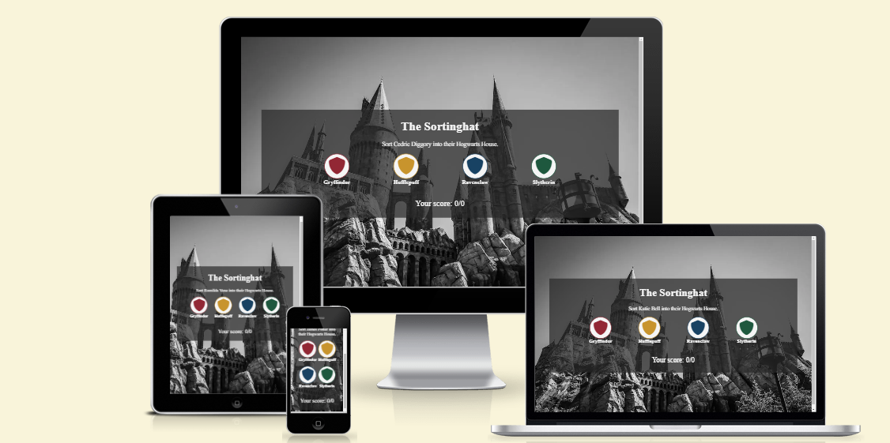
Since I used % and flexbox when styling the different parts of the page there was no need for media queries to adjust the styling to different screensizes.

## The color scheme

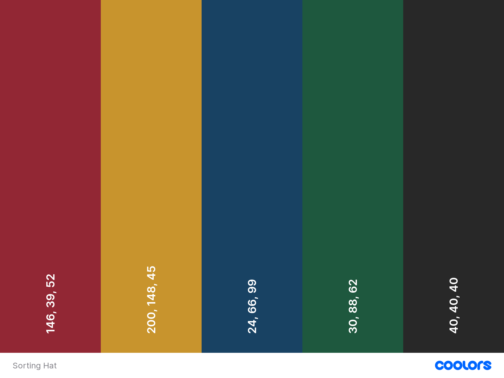
For this project I choose to extract a nice gray color from the background-image and then the four house colors.

## The font

- I used the Google Font "Zen Old Mincho" for the whole webpage beacause I thought it had a "Hogwartsy" look to it.

## Features

### Favicon

- Next to the title of the page there is a favicon that looks like a wizard.
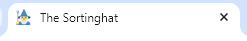

### Div containing text

- At the top of the page there is a div containing a h1 element and a paragraph.
- In the paragraph there is a span element and this is where the name of the student you're gonna sort shows up.

### The housebuttons

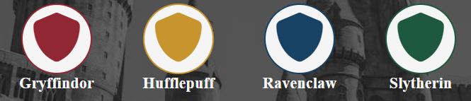

- The four housebuttons are colored according to the Hogwarts house-colors
- All the buttons have eventlisteners so that when you move the mouse over them their color cover the whole button and when you click them you tell the script to check if the value of the button matches the house value in the characters array.
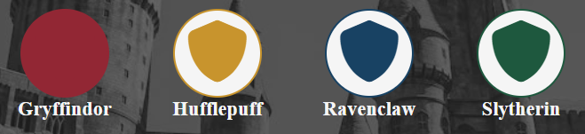

### Resultarea

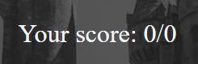

- Of course the user will want to keep track of how many correct answers they have so therefore there is a resultarea bellow the housebuttons.
- The number on the left keeps track of how many students you've sorted correctly and the number on the right keeps track of how many questions you've answered including the ones you've gotten wrong.
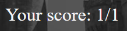
- As you see above both numbers have changed so this means you sorted the student in to the rigth house.
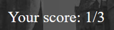
- As you can see now the number on the left is still one but the number on the right is three so this means you've answered three questions but you've only gotten one right.

### Alerts

- If you get a question wrong you get an alert saying as the example above "Sorry, that's wrong... Cho Chang is in ravenclaw"
- This informs the user that the answer was incorrect and they learn which house is the right one.
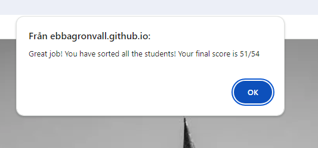
- When you've sorted all the students you get an alert telling you that you did a great job and what your final score is.

## Testing

- I checked to see that the webpage works on the browsers: Chrome, Microsoft Edge and Safari.
- By using devtools I confirmed that the page is responsive an adjusts well to different screensizes.
- I checked that the webpage is easy to understand and readable by running it through https://wave.webaim.org/.
- I checked that the game works by answering some questions wrong to see that the alert comes up with the correct answer and that the right number in the score-area changes but the left one does not.

### Validator Testing

- HTML

  - No errors were found when passing the code through the W3C Validator.

- CSS
  - No errors were found when passing the stylesheet through Jigwas Validator.
- Accessibility
  - I confirmed mu webpages accessibility by testing it in Lighthouse and checking it with wave.

### Results in lighthouse

#### Index.html

- Desktop
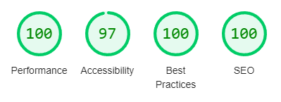
- Mobile

### Unfixed Bugs

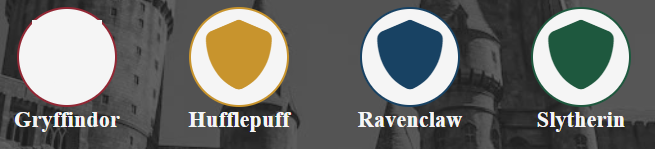

- I have one unfixed bug that is that when you move the mouse over the housebuttons sometimes the sheild-icon turns into a white square.
- I tried to fix it both in css and in JavaScript but where unsuccesfull.
- I found information about how this might be because of the fact that it is an fontawesome icon.

## Deployment

- I deployed the webpage to GitHub pages early in the process.
- To deploy a webpage through GitHub you have to:
  - Go to the repository that you want to deploy
  - Click on the settings tab at the top
  - On the lefthand side you click on "Pages"
  - In the Source drop-down menu you select "Deploy from branch"
  - Then you select the branch you want to deploy and in this case it was the main branch and the root folder.
  - All you have to do now is to make sure that your latest changes are pushed to GitHub and the page will be up and running once it's loaded.

## Credits

### Names and inspiration

- All the names and the houses are from J.K. Rowlings books about Harry Potter.

### Media

- The background-image is from https://www.pexels.com/sv-se/
- The favicon is from https://favicon.io/
- The icons for the buttons are from https://fontawesome.com/

### Special Thanks

- My mentor Graeme Taylor has been a trooper helping me throught this project that I've been struggling with.
